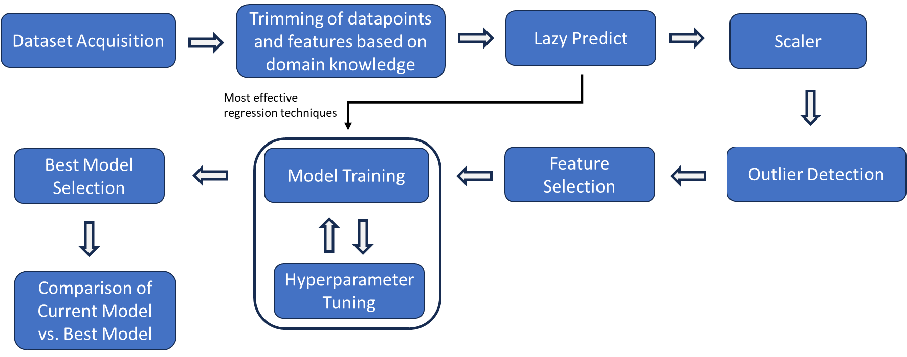

# Enhancing Hydrogen Consumption Predictions in Refinery Hydrotreating through Machine Learning Techniques

**Authors:** Alister Marc Domilies, Leo Julongbayan, Jemar Laag

## Abstract

Accurate prediction of hydrogen consumption in refinery hydrotreating processes is crucial for maintaining efficient refinery operations. This project aims to enhance the accuracy of hydrogen consumption predictions by employing a comprehensive machine learning pipeline that encompasses outlier detection, dimensionality reduction, and advanced regression modeling. The result is a highly accurate and robust prediction model that significantly outperforms traditional regression models.

## Introduction

Refineries heavily depend on hydrogen for purifying petroleum products through processes like hydrotreating. Accurately predicting hydrogen consumption is a significant challenge due to its highly complex and non-linear nature. This project develops a machine learning model to forecast hydrogen consumption in refinery hydrotreating processes accurately.

## Dataset

The model is trained on a time-series dataset from a hydrotreating unit. The dataset includes the following features:

*   `Feed_1` to `Feed_6`: Feed rates of different qualities.
*   `Sulfur_Product`: Sulfur concentration in the product.
*   `Inlet_Temp`: Inlet temperature of the reactor.
*   `Catalyst_Age`: Age of the catalyst in days.

The target variable is `H2_Consumption`.

**Note:** The dataset used for this project is confidential and is not included in this repository.

## Methodology

The machine learning pipeline is implemented in the `h2_prediction_pipeline.py` script and consists of the following steps:

1.  **Data Loading and Preprocessing**: The data is loaded, and new features (`Hour`, `Year`, `Month`, `Catalyst_Age`) are engineered from the timestamp.
2.  **Exploratory Data Analysis (EDA)**: The script generates and saves plots to visualize the data and understand the relationships between features.
3.  **Outlier Removal**: Outliers are removed from the dataset using Kernel Density Estimation (KDE) to improve model robustness.
4.  **Candidate Model Selection**: `LazyPredict` is used to quickly evaluate and identify the top 3 performing regression models as candidates for further tuning.
5.  **Feature Selection**: Recursive Feature Elimination with Cross-Validation (RFECV) is used to select the most important features.
6.  **Hyperparameter Tuning**: The hyperparameters for the top 3 models (`RandomForest`, `ExtraTrees`, and `LightGBM`) are tuned using Optuna.
7.  **Model Training and Evaluation**: The best-performing model (Extra Trees Regressor) is trained on the preprocessed and feature-selected data and evaluated on a held-out test set.
8.  **Model Saving**: The final trained model is saved to a file for future use.

A visual representation of the pipeline can be found in below.



## Results

The final model, a tuned `ExtraTreesRegressor`, achieved the following performance on the test set:

*   **Test RMSE**: 356.2
*   **Test R² Score**: 0.988

This is a significant improvement over the baseline linear regression model.

## Project Structure

The repository is organized as follows:

-   `h2_prediction_pipeline.py`: The main script for the machine learning pipeline.
-   `requirements.txt`: A list of Python packages required to run the project.
-   `Paper.pdf`: The research paper detailing the study.
-   `Presentation.pdf`: The presentation summarizing the project.
-   `README.md`: This file.

## How to Use

1.  Ensure you have Python installed.
2.  Install the necessary libraries by running:
    ```bash
    pip install -r requirements.txt
    ```
3.  You will need to provide your own data file in the same format as described in the Dataset section. Update the `DATA_FILE` variable in `h2_prediction_pipeline.py` to point to your dataset.
4.  To run the entire pipeline, execute the following command:
    ```bash
    python h2_prediction_pipeline.py
    ```
5.  The script will generate an `output` directory containing EDA plots, feature selection results, and the final trained model (`final_hydrogen_consumption_model.joblib`).
